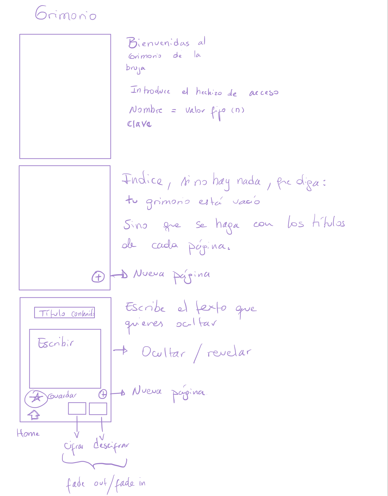

# Grimorio: proyecto de cifrado cesar 
## El libro secreto de la bruja

### Grimorio como solución
Un grimorio es un libro utilizado por brujas y hechiceros para guardar sus encantamientos, brujerías y recetas mágicas. Muchas veces estos libros están protegidos por mágia, para que su contenido no sea visto por cualquier ser mortal o mágico y que los secretos que se esconden dentro no puedan ser facilmente revelados. Es por eso que se eligió esta temática para aplicar el cifrado cesar y así ocultar el contenido de las páginas del libro, de manera que sólo quien conozca el hechizo pueda revelar lo que se oculta en ellas.

### Usuario y formato        
El formato de la página web está pensado como un libro, con una portada, índice y páginas para escribir cualquier tipo de información que se quiera ocultar. Su diseño y funcionalidad llama a usuarios entusiastas de la mágia, lo místico, lo oculto y misterioso, para que utilicen el libro como más lo necesiten, pudiendo ocultar y guardar recetas y tips, utilizarlo como diario de vida, para escribir notas secretas (o decifrarlas), entre otras utilidades. 

El diseño donde se implementa el cifrado se pensó como un solo cuadro de texto, donde reemplaza lo que está escrito a medida que se cifra o decifra (revelar u ocultar el texto). Dado que es una página de un libro, queda el texto tal como lo defina el usuario. Cada vez que se haga clic en el botón, este cifrará y decifrará intercaladamente en ese orden, reiniciando la función cada vez que se manipule el offset, el que debe seleccionarte previamente a cifrar. Para comenzar decifrando un texto, se debe seleccionar el offset con el que viene cifrado, pero en su versión negativa o positiva según aplique. Por ejemplo si un texto viene cifrado con un offset 8, para decifrarlo hay que seleccionar el offset -8 y hacer clic en el botón de cifrado/decifrado.  

### Evolución del diseño

* Prototipo a mano

Tomando en cuenta funcionalidad

</img>

* Primer prototipo en figma

Se comienzan a trabajar las páginas y su estructura

</img>
</img>
</img>

* Correcciones de prototipo en figma

Se agregan imágenes acorde a la temática para el fondo de cada página o portada y estructura, sin el texto, ya que será agregado en html acorde a las funciones que desempeñan (enlaces, editables, etc).

Los botones fueron pensados para ser transparentes, agregando funcionalidad a la zona, utilizando el ícono que incluye la imagen de la página.

</img>
</img>
</img>

* Idea para instrucciones

Imagen para agregar instrucciones en un futuro de ser necesarias

</img>

### Visita el grimorio aquí

https://gabrieladana.github.io/SCL019-cipher/